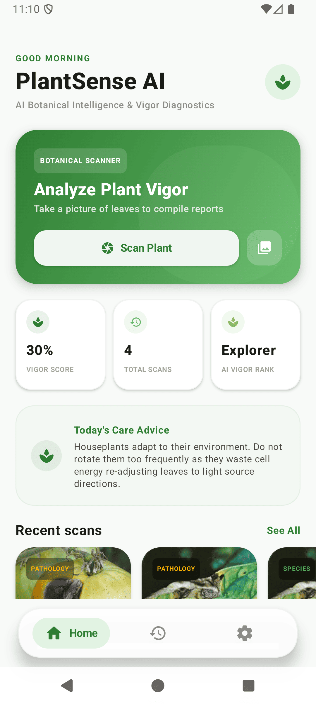
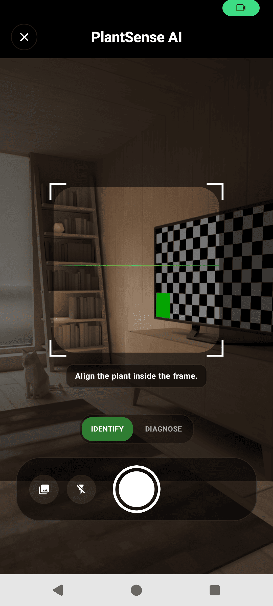
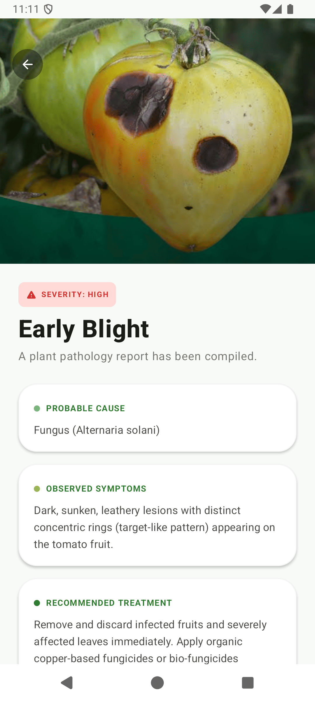
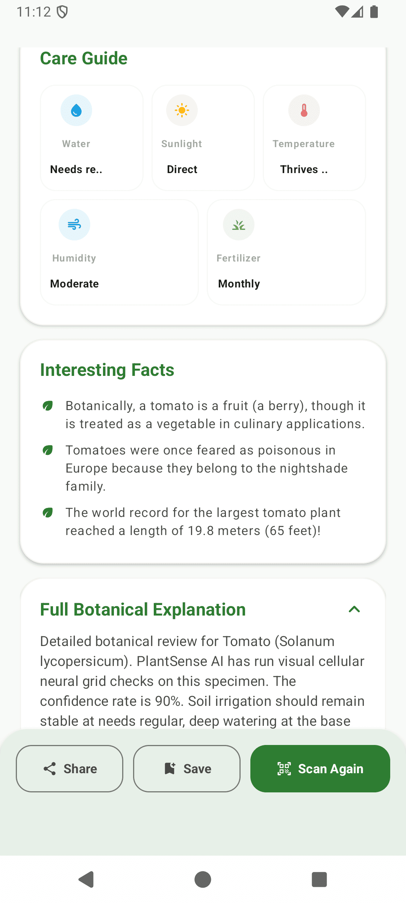

# 🌿 PlantSense AI - Premium Plant Identification & Leaf Diagnostics

[](https://developer.android.com)
[](https://kotlinlang.org)
[](https://developer.android.com)
[](https://developer.android.com)
[](https://ai.google.dev/)

PlantSense AI is a state-of-the-art Android application that leverages **Google's Gemini 3.5 AI** to deliver real-time plant identification, detailed botanical care reports, and leaf pathology diagnostics. Designed with a premium, nature-inspired user experience, the app stands as a showcase of modern Android development best practices, featuring **Clean Architecture, Jetpack Compose (Material 3), CameraX, Room database, and Hilt Dependency Injection.**

---

## 📸 Screenshots

<table width="100%">
  <thead>
    <tr>
      <th align="center" width="25%">Home Dashboard</th>
      <th align="center" width="25%">Pixel Viewfinder</th>
      <th align="center" width="25%">Diagnostics Report</th>
      <th align="center" width="25%">Profile Passport</th>
    </tr>
  </thead>
  <tbody>
    <tr>
      <td align="center"></td>
      <td align="center"></td>
      <td align="center"></td>
      <td align="center"></td>
    </tr>
  </tbody>
</table>

---

## 🛠️ Architecture & Design Patterns

The codebase is strictly structured according to **Clean Architecture** principles and **MVVM** design patterns. This separation of concerns ensures that business logic remains entirely decoupled from database schemas and visual frameworks, facilitating high testability and maintainability.

```
       +---------------------------------------------------+
       |            Presentation Layer (MVVM)              |
       |  - UI: Jetpack Compose (Material 3 Screens)       |
       |  - State Management: ViewModels (StateFlow)       |
       +-------------------------+-------------------------+
                                 |
                                 v
       +---------------------------------------------------+
       |                 Domain Layer                      |
       |  - Use Cases (IdentifyPlant, DetectDisease, etc.) |
       |  - Domain Models (PlantResult, ScanHistoryItem)   |
       |  - Repository Contracts                           |
       +-------------------------+-------------------------+
                                 |
                                 v
       +---------------------------------------------------+
       |                  Data Layer                       |
       |  - Room DB (scan_history persistence)             |
       |  - Jetpack DataStore (API credentials)            |
       |  - Retrofit GeminiApiService (Multimodal REST API)|
       |  - Repository Implementations                     |
       +---------------------------------------------------+
```

### Architectural Breakdown
* **Presentation Layer (MVVM)**: Handles rendering via Jetpack Compose. ViewModels capture user inputs, interact with use cases, and expose UI state flows reactively using `StateFlow` and `collectAsStateWithLifecycle()`.
* **Domain Layer (Clean Architecture)**: The core business boundary containing domain models (`PlantIdentificationResult`, `ScanHistoryItem`), repository contracts, and single-purpose UseCases (`IdentifyPlantUseCase`, `DetectDiseaseUseCase`). Contains zero dependencies on Android frameworks or Hilt classes.
* **Data Layer**: Implements repository interfaces, coordinating data between local storage (Room, DataStore) and the cloud. Uses mappers to convert database entities and remote DTOs into domain models.

---

## 🧠 Gemini AI Structured Diagnostics

PlantSense AI accesses the **Gemini 3.5 Flash** REST API to perform multimodal image analysis. To guarantee absolute runtime safety and prevent json parsing exceptions, the app enforces strict structured data models via **JSON Schema Generation Configuration**:

### 1. Species Identification
- **Multimodal prompt**: Combines the captured photo (converted to Base64) with detailed query instructions.
- **Response Schema**: Declares properties for `plantName`, `botanicalName`, `confidence` score, `description`, `careLight`, `careWater`, and `careTemp`.
- **Enforced Format**: Restricts Gemini's response structure to raw JSON matching the schema parameters (`responseMimeType = "application/json"`).

### 2. Leaf Pathology Checkup
- Enforces a boolean `isHealthy` status.
- Diagnoses and maps active diseases, extracting causes, symptoms, treatments, and prevention rules only if pathology is verified.

---

## ⚙️ Core Technical Capabilities

### 📷 Immersive Camera HUD (`CameraX`)
- **Immersive Viewfinder Layout**: High-end full-bleed preview mask enclosing a centered `250.dp` rounded square cutout.
- **Dynamic Lens Switching**: Switches live preview binds between back and front camera modules.
- **Flash Torch Integration**: Direct camera control triggers that toggle camera torch hardware parameters.
- **Photo Gallery Selection**: Standard Android picker integration that copies chosen content URIs into internal sandbox cache files using local stream helpers.

### 💾 Local Storage & Caching
- **Room Database**: Persists scan history items (`scan_history` table) including timestamps, match confidence, species data, and pathology diagnostics.
- **Persistent Image Sandboxing**: Avoids storing ephemeral content URIs. Scanned images are saved into `context.filesDir/scans` as absolute local files referenced by Room keys.
- **DataStore Preferences**: Securely manages configurations including user-defined Gemini API developer keys. If no key is configured, fallback logic automatically routes queries through a pre-defined `BuildConfig` developer key.

### 🔄 WorkManager Offline Cleanups
- Registers `CleanUpWorker` tasks to delete transient cached photos in `context.cacheDir` that are older than 24 hours.
- Safely bypasses Room directory files, preventing broken thumbnail references.

### 🧭 Navigation & Transitions
- **Type-Safe Routes**: Leverages type-safe routes (`AppRoute`) via Navigation Compose.
- **Smooth Page Transitions**: Custom global transitions configured at `NavHost` level:
  - Enter: Right-to-Left slide with `EaseInOutSine` combined with quick alpha fades.
  - Pop Enter/Exit: Symmetrical Left-to-Right slides when returning back.
- **Glassmorphic Navigation Bar**: A floating bottom navigation bar utilizing semi-transparent background cards and animated active selection pills.

---

## 📦 Libraries & Technology Stack

- **UI Framework**: [Jetpack Compose](https://developer.android.com/jetpack/compose) with [Material Design 3](https://m3.material.io/)
- **Image Loading**: [Coil Compose](https://coil-kt.github.io/coil/) (Asynchronous image loader)
- **Dependency Injection**: [Dagger Hilt](https://dagger.dev/hilt/) (Compile-time dependency injection)
- **Database**: [Room SQLite Wrapper](https://developer.android.com/training/data-storage/room)
- **Preferences**: [Jetpack DataStore Preferences](https://developer.android.com/topic/libraries/architecture/datastore)
- **Network**: [Retrofit 2](https://square.github.io/retrofit/) & [OkHttp Logging Interceptor](https://github.com/square/okhttp)
- **Asynchronous / Stream Utilities**: [Kotlin Coroutines](https://kotlinlang.org/docs/coroutines-overview.html) & [Kotlin Flow](https://kotlinlang.org/docs/flow.html)
- **Background Jobs**: [Jetpack WorkManager](https://developer.android.com/topic/libraries/architecture/workmanager)
- **Centralized Logging**: [Timber](https://github.com/JakeWharton/timber)
- **Image Metadata**: [AndroidX ExifInterface](https://developer.android.com/reference/androidx/exifinterface/media/ExifInterface)

---

## 🧪 Quality Assurance & Unit Testing

The project maintains comprehensive test coverage across core architectural layers, ensuring business rules, repository flows, and ViewModel states remain regression-free.

- **Use Case Testing**: Validates business rules (`IdentifyPlantUseCaseTest.kt`) using MockK dependencies.
- **Repository Testing**: Mocks Retrofit network services and local DAOs to verify correct model mapping and error-handling cascades (`PlantRepositoryImplTest.kt`).
- **ViewModel Testing**: Verifies UI state flows under success, loading, and failure states (`HomeViewModelTest.kt`, `CameraViewModelTest.kt`) utilizing custom coroutines test dispatchers and **Turbine** for flow collections.

---

## 🚀 Building & Getting Started

### Prerequisites
1. Android Studio Ladybug (2024.1.3) or newer.
2. Android SDK 36 (targetSdk) and minSdk 24.
3. A Gemini API Developer Key (Obtain a key from [Google AI Studio](https://aistudio.google.com/)).

### Project Compilation
Configure your Gemini Developer Key by adding it to your `gradle.properties` file in the project root:
```properties
G_API_KEY=your_gemini_api_key_here
```
*(Note: Do not wrap the value in quotes inside gradle.properties; the build script handles quote formatting automatically during code generation).*

Compile the debug application using Gradle:
```bash
./gradlew assembleDebug
```

Run unit test assertions:
```bash
./gradlew testDebugUnitTest
```
